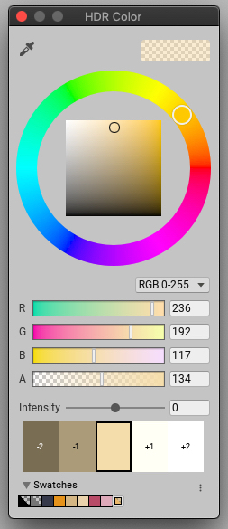
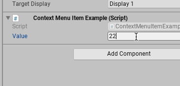
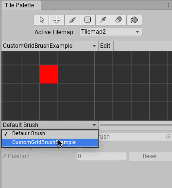
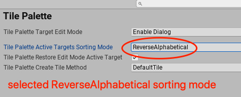

# Unity-Attributes-Example

 Unity attribute 例子整理

[AddComponentMenu](Assets/Unity%20Attributes%20Example/1.AddComponentMenu/AddComponentMenuExample.cs) （添加组件菜单）

 
[AssemblyIsEditorAssembly](Assets/Unity%20Attributes%20Example/2.AssemblyIsEditorAssembly/AssemblyIsEditorAssemblyExample.cs) （引擎会把该程序集下的全部类视为编辑器类）

[BeforeRenderOrder](Assets/Unity%20Attributes%20Example/3.BeforeRenderOrder/BeforeRenderOrderExample.cs) （设置Application.onBeforeRender回调函数的执行顺序）

[ColorUsage](Assets/Unity%20Attributes%20Example/4.ColorUsage/ColorUsageExample.cs) （拾色器界面）

[ContextMenu](Assets/Unity%20Attributes%20Example/5.ContextMenu/ContextMenuExample.cs) (为脚本添加快捷菜单)

[ContextMenuItem](Assets/Unity%20Attributes%20Example/6.ContextMenuItem/ContextMenuItemExample.cs)  （为脚本字段添加快捷菜单）

[CreateAssetMenu](Assets/Unity%20Attributes%20Example/7.CreateAssetMenu/CreateAssetMenuExample.cs) （添加ScriptableObject的创建菜单）

[CustomGridBrush](Assets/Unity%20Attributes%20Example/8.CustomGridBrush/Editor/CustomGridBrushExample.cs) （自定义笔刷）

[Delayed](Assets/Unity%20Attributes%20Example/9.Delayed/DelayedExample.cs) （延迟设置字段的值）

[DisallowMultipleComponent](Assets/Unity%20Attributes%20Example/10.DisallowMultipleComponent/DisallowMultipleComponentExample.cs) （不允许多次挂载同一个脚本到同一个物体上）

[ExcludeFromObjectFactory](Assets/Unity%20Attributes%20Example/11.ExcludeFromObjectFactory/ExcludeFromObjectFactoryExample.cs)

[ExcludeFromPreset](Assets/Unity%20Attributes%20Example/12.ExcludeFromPreset/ExcludeFromPresetExample.cs)

[ExecuteAlways](Assets/Unity%20Attributes%20Example/13.ExecuteAlways/ExecuteAlwaysExample.cs)

[ExecuteInEditMode](Assets/Unity%20Attributes%20Example/14.ExecuteInEditMode/ExecuteInEditModeExample.cs)

[GradientUsage](Assets/Unity%20Attributes%20Example/15.GradientUsage/GradientUsageExample.cs)

[GUITarget](Assets/Unity%20Attributes%20Example/16.GUITarget/GUITargetExample.cs)

[Header](Assets/Unity%20Attributes%20Example/17.Header/HeaderExample.cs)

[HelpURL](Assets/Unity%20Attributes%20Example/18.HelpURL/HelpURLExample.cs)

[HideInInspector](Assets/Unity%20Attributes%20Example/19.HideInInspector/HideInInspectorExample.cs)

[Multiline](Assets/Unity%20Attributes%20Example/20.Multiline/MultilineExample.cs)

[PreferBinarySerialization](Assets/Unity%20Attributes%20Example/21.PreferBinarySerialization/PreferBinarySerializationExample.cs)

[Range](Assets/Unity%20Attributes%20Example/22.Range/RangeExample.cs)

[RequireComponent](Assets/Unity%20Attributes%20Example/23.RequireComponent/RequireComponentExample.cs)

[RuntimeInitializeOnLoadMethod](Assets/Unity%20Attributes%20Example/24.RuntimeInitializeOnLoadMethod/RuntimeInitializeOnLoadMethodExample.cs) - 回调函数（程序启动时）

[SelectionBase](Assets/Unity%20Attributes%20Example/25.SelectionBase/SelectionBaseExample.cs)

[SerializeField](Assets/Unity%20Attributes%20Example/26.SerializeField/SerializeFieldExample.cs)

[SharedBetweenAnimators](Assets/Unity%20Attributes%20Example/27.SharedBetweenAnimators/SharedBetweenAnimatorsExample.cs)

[Space](Assets/Unity%20Attributes%20Example/28.Space/SpaceExample.cs)

[TextArea](Assets/Unity%20Attributes%20Example/29.TextArea/TextAreaExample.cs)

[Tooltip](Assets/Unity%20Attributes%20Example/30.Tooltip/TooltipExample.cs) - 提示（Inspector面板->鼠标停留在脚本的属性上）

[UnityAPICompatibilityVersion](Assets/Unity%20Attributes%20Example/31.UnityAPICompatibilityVersion/UnityAPICompatibilityVersionExample.cs)

[FormerlySerializedAs](Assets/Unity%20Attributes%20Example/32.FormerlySerializedAs/FormerlySerializedAsExample.cs)

[CanEditMultipleObjects](Assets/Unity%20Attributes%20Example/33.CanEditMultipleObjects/Editor/CanEditMultipleObjectsExampleEditor.cs)

[CustomPreview](Assets/Unity%20Attributes%20Example/34.CustomPreview/Editor/MyObjectPreview.cs)

[CustomPropertyDrawer](Assets/Unity%20Attributes%20Example/35.CustomPropertyDrawer/Editor/TabEnumAttributeDrawer.cs)

[DrawGizmo](Assets/Unity%20Attributes%20Example/36.DrawGizmo/Editor/MyScriptGizmoDrawer.cs)

[InitializeOnLoad](Assets/Unity%20Attributes%20Example/37.InitializeOnLoad/Editor/InitializeOnLoadExample.cs) - 该类在Unity引擎打开时会被创建

[InitializeOnLoadMethod](Assets/Unity%20Attributes%20Example/37.InitializeOnLoad/Editor/InitializeOnLoadExample.cs) - 回调函数（打开Unity引擎后）

[OnOpenAsset](Assets/Unity%20Attributes%20Example/38.OnOpenAsset/Editor/OnOpenAssetExample.cs) - 打开资源时（Asset面板->双击选中的文件)

[PostProcessBuild](Assets/Unity%20Attributes%20Example/39.PostProcessBuild/Editor/PostProcessBuildExample.cs) - 回调函数（每次发布程序后）

[PostProcessScene](Assets/Unity%20Attributes%20Example/40.PostProcessScene/Editor/PostProcessSceneExample.cs) - 回调函数（每次进入场景前）

[GridPaintSorting](Assets/Unity%20Attributes%20Example/41.GridPaintSorting/README.md)（the sorting of Active Targets in the Active Tilemap list of the Tile Palette window）

[MenuItem](Assets/Unity%20Attributes%20Example/42.MenuItem/Editor/MenuTest.cs)

[SettingsProvider](Assets/Unity%20Attributes%20Example/43.SettingsProvider/Editor/MyCustomSettings.cs)
