# Unity-Attributes-Example

---

 Unity Attribute 例子整理


[AddComponentMenu](Assets/Unity-Attributes-Example/1.AddComponentMenu/AddComponentMenuExample.cs)

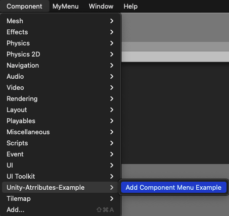

```
添加组件菜单
```


[AssemblyIsEditorAssembly](Assets/Unity-Attributes-Example/2.AssemblyIsEditorAssembly/AssemblyIsEditorAssemblyExample.cs)


```
引擎会把该程序集下的全部类视为编辑器类
```


[BeforeRenderOrder](Assets/Unity-Attributes-Example/3.BeforeRenderOrder/BeforeRenderOrderExample.cs)


```
设置Application.onBeforeRender回调函数的执行顺序
```


[ColorUsage](Assets/Unity-Attributes-Example/4.ColorUsage/ColorUsageExample.cs)


```
DHR拾色器界面
```


[ContextMenu](Assets/Unity-Attributes-Example/5.ContextMenu/ContextMenuExample.cs)

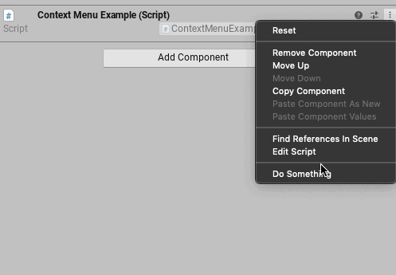

```
为脚本添加快捷菜单
```


[ContextMenuItem](Assets/Unity-Attributes-Example/6.ContextMenuItem/ContextMenuItemExample.cs)


```
为脚本字段添加快捷菜单
```


[CreateAssetMenu](Assets/Unity-Attributes-Example/7.CreateAssetMenu/CreateAssetMenuExample.cs)

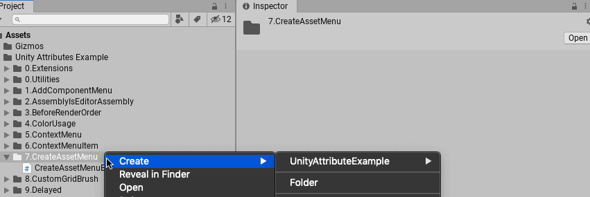

```
添加ScriptableObject的创建菜单
```


[CustomGridBrush](Assets/Unity-Attributes-Example/8.CustomGridBrush/Editor/CustomGridBrushExample.cs)


```
自定义Tilemap笔刷
```


[Delayed](Assets/Unity-Attributes-Example/9.Delayed/DelayedExample.cs)

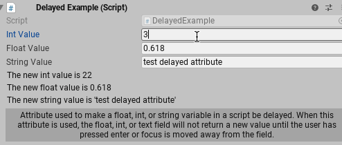

```
延迟更新字段的值
```


[DisallowMultipleComponent](Assets/Unity-Attributes-Example/10.DisallowMultipleComponent/DisallowMultipleComponentExample.cs)

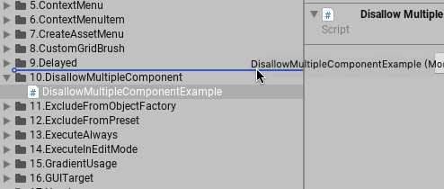

```
不允许多次挂载同一个脚本到同一个物体上
```


[ExcludeFromObjectFactory](Assets/Unity-Attributes-Example/11.ExcludeFromObjectFactory/ExcludeFromObjectFactoryExample.cs)

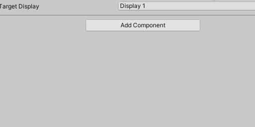

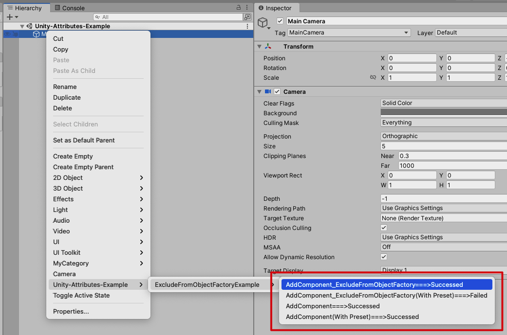

```
添加[ExcludeFromObjectFactory]后，调用ObjectFactory.AddComponent<对应组件>时，会失败并报错
```


[ExcludeFromPreset](Assets/Unity-Attributes-Example/12.ExcludeFromPreset/ExcludeFromPresetExample.cs)


```
添加[ExcludeFromPreset]后，即便用代码生成Preset，Preset的参数也不支持设置
```


```
添加[ExcludeFromPreset]后，不能选择和保存为Preset
```


[ExecuteAlways](Assets/Unity-Attributes-Example/13.ExecuteAlways/ExecuteAlwaysExample.cs)

```
using UnityEngine;

[ExecuteAlways]
public class ExampleClass : MonoBehaviour
{
    void Start()
    {
        if (Application.IsPlaying(gameObject))
        {
            // Play logic
        }
        else
        {
            // Editor logic
        }
    }
}
```


[ExecuteInEditMode](Assets/Unity-Attributes-Example/14.ExecuteInEditMode/PrintAwake.cs)

```
    /// <summary>
    /// https://docs.unity3d.com/ScriptReference/ExecuteInEditMode.html
    /// </summary>

    // The PrintAwake script is placed on a GameObject.  
    // The Awake function is usually
    // called when the GameObject is started at runtime.  
    // Due to the ExecuteInEditMode
    // attribute, the script is also called by the Editor.  
    // The Awake() function will be called,
    // for example, when the Scene is changed to a
    // different Scene in the Project window.
    // The Update() function is called, 
    // for example, when the GameObject transform
    // position is changed in the Editor.

    [ExecuteInEditMode]
    public class PrintAwake : MonoBehaviour {
        void Awake() {
            Debug.Log("Editor causes this Awake");
        }

        void Update() {
            Debug.Log("Editor causes this Update");
        }
    }
```


[GradientUsage](Assets/Unity-Attributes-Example/15.GradientUsage/GradientUsageExample.cs)


```
颜色渐变界面
```


[GUITarget](Assets/Unity-Attributes-Example/16.GUITarget/GUITargetExample.cs)


```
// 控制OnGUI函数调用，在哪些显示设备上有效

// GUITarget attribute allows to control for which display the OnGUI is called.

[GUITarget(1, 2)]
void OnGUI() {
    var color = GUI.color;
    GUI.color = Color.red;
    GUILayout.Space(30f);
    GUILayout.Label("     This information is visible on 'Display 2' and 'Display 3' only.");
    GUI.color = color;
}

```


[Header](Assets/Unity-Attributes-Example/17.Header/HeaderExample.cs)


```
[Header("Health Settings")]
public int health = 0;
public int maxHealth = 100;

[Header("Shield Settings")]
public int shield = 0;
public int maxShield = 0;
```


[HelpURL](Assets/Unity-Attributes-Example/18.HelpURL/HelpURLExample.cs)


```
点击组件上的问号按钮，会打开指定的网站
```


[HideInInspector](Assets/Unity-Attributes-Example/19.HideInInspector/HideInInspectorExample.cs)


```
// 隐藏字段
[HideInInspector]
public int p = 5;
```


[Multiline](Assets/Unity-Attributes-Example/20.Multiline/MultilineExample.cs)

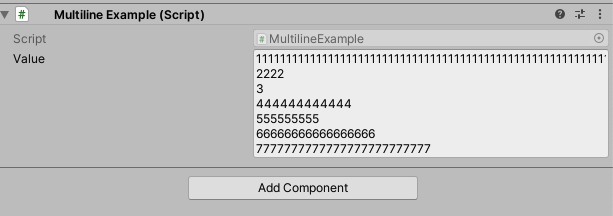

```
// 指定字符串能显示的行数（我也不知道为什么只显示了7行）
[Multiline(8)]
public string value;

还有，需要按回车才能换行
```


[PreferBinarySerialization](Assets/Unity-Attributes-Example/21.PreferBinarySerialization/PreferBinarySerializationExample.cs)


```
（继承ScriptableObject的类）添加[PreferBinarySerialization]后，
对应的asset文件的存储格式，会变成二进制格式
```


[Range](Assets/Unity-Attributes-Example/22.Range/RangeExample.cs)

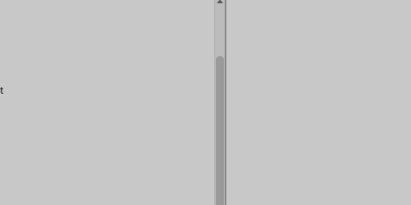

```
滑条样式
```


[RequireComponent](Assets/Unity-Attributes-Example/23.RequireComponent/RequireComponentExample.cs)


```
1. 自动添加依赖的组件
2. 不能手动移除依赖的组件（必须先移除该组件，才能移除依赖的组件）
```


[RuntimeInitializeOnLoadMethod](Assets/Unity-Attributes-Example/24.RuntimeInitializeOnLoadMethod/RuntimeInitializeOnLoadMethodExample.cs)

```

运行时初始化，触发调用（全都只触发一次）

class RuntimeInitializeOnLoadMethodExample {

    // Callback used for registration of subsystems
    [RuntimeInitializeOnLoadMethod(RuntimeInitializeLoadType.SubsystemRegistration)]
    static void OnSubsystemRegistration() {
        Debug.Log("0.OnSubsystemRegistration");
    }

    // Callback when all assemblies are loaded and preloaded assets are initialized.
    [RuntimeInitializeOnLoadMethod(RuntimeInitializeLoadType.AfterAssembliesLoaded)]
    static void OnAfterAssembliesLoaded() {
        Debug.Log("1.OnAfterAssembliesLoaded");
    }

    [RuntimeInitializeOnLoadMethod(RuntimeInitializeLoadType.BeforeSplashScreen)]
    static void OnBeforeSplashScreen() {
        Debug.Log("2.Before the splash screen is shown.");
    }

    // 加载第一个场景时会被调用
    [RuntimeInitializeOnLoadMethod(RuntimeInitializeLoadType.BeforeSceneLoad)]
    static void OnBeforeSceneLoad() {
        Debug.Log("3.Before first Scene loaded");
    }

    // 等价于[RuntimeInitializeOnLoadMethod(RuntimeInitializeLoadType.AfterSceneLoad)]
    [RuntimeInitializeOnLoadMethod]
    static void OnAfterSceneLoad1() {
        Debug.Log("4-1.After first Scene loaded");
    }

    [RuntimeInitializeOnLoadMethod(RuntimeInitializeLoadType.AfterSceneLoad)]
    static void OnAfterSceneLoad2() {
        Debug.Log("4-2.After first Scene loaded");
    }

    [RuntimeInitializeOnLoadMethod]
    static void OnAfterSceneLoad3() {
        Debug.Log("4-3.After first Scene loaded");
    }

}
```


[SelectionBase](Assets/Unity-Attributes-Example/25.SelectionBase/SelectionBaseExample.cs)

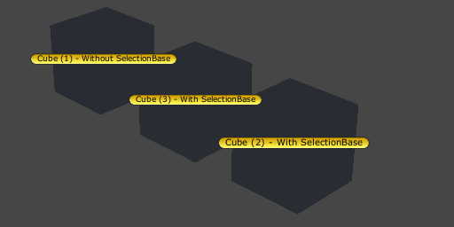

```
在Scene窗口，
点击没带[SelectionBase]的组件的物体时，
自动选择父级里，带[SelectionBase]的组件的物体
```


[SerializeField](Assets/Unity-Attributes-Example/26.SerializeField/SerializeFieldExample.cs)

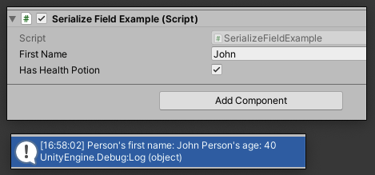

- [查看官方文档](https://docs.unity3d.com/ScriptReference/SerializeField.html)

```
    //This field gets serialized because it is public.
    public string firstName = "John";

    //This field does not get serialized because it is private.
    private int age = 40;

    //This field gets serialized even though it is private
    //because it has the SerializeField attribute applied.
    [SerializeField]
    private bool hasHealthPotion = true;

    void Start()
    {
        if (hasHealthPotion)
            Debug.Log("Person's first name: " + firstName + " Person's age: " + age);
    }
```


[SharedBetweenAnimators](Assets/Unity-Attributes-Example/27.SharedBetweenAnimators/SharedBetweenAnimatorsExample.cs)


```

添加后，能在不同Animator间共享同一个StateMachineBehaviour

// 测试例子

// SharedBetweenAnimatorsExampleCounter.cs

public List<SharedBetweenAnimatorsExample> StateMachineBehaviours;
public List<Animator> Animators;

// SharedBetweenAnimatorsExample.cs

[SharedBetweenAnimators]
public class SharedBetweenAnimatorsExample : StateMachineBehaviour {

    override public void OnStateEnter(Animator animator, AnimatorStateInfo stateInfo, int layerIndex) {

        var Animators = SharedBetweenAnimatorsExampleCounter.Instance.Animators;
        if (!Animators.Contains(animator)) {
            Animators.Add(animator);
        }

        var StateMachineBehaviours = SharedBetweenAnimatorsExampleCounter.Instance.StateMachineBehaviours;
        if (!StateMachineBehaviours.Contains(this)) {
            StateMachineBehaviours.Add(this);
        }
    }

}

运行结果：

StateMachineBehaviours长度为1，Animators长度为2，
两个动画共享同一个SharedBetweenAnimatorsExample

```


[Space](Assets/Unity-Attributes-Example/28.Space/SpaceExample.cs)

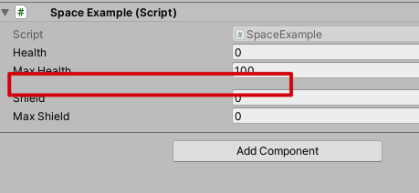

```
在字段间加一段间隔
```


[TextArea](Assets/Unity-Attributes-Example/29.TextArea/TextAreaExample.cs)


```
可自动换行的字符串界面样式
```


[Tooltip](Assets/Unity-Attributes-Example/30.Tooltip/TooltipExample.cs)


```
光标停留在字段名字上一段时间后，显示提示
```


[UnityAPICompatibilityVersion](Assets/Unity-Attributes-Example/31.UnityAPICompatibilityVersion/UnityAPICompatibilityVersionExample.cs)

[FormerlySerializedAs](Assets/Unity-Attributes-Example/32.FormerlySerializedAs/FormerlySerializedAsExample.cs)


```
指定旧字段的名字，防止字段改名后造成的数据丢失

// FormerlySerializedAsExample.cs

public class FormerlySerializedAsExample : MonoBehaviour {
			public string myValue;
}

====>

public class FormerlySerializedAsExample : MonoBehaviour {

      [FormerlySerializedAs("myValue")]
      [SerializeField]
      string m_MyValue;

      public string myValue {
            get { return m_MyValue; }
            set { m_MyValue = value; }
      }

}

```


[CanEditMultipleObjects](Assets/Unity-Attributes-Example/33.CanEditMultipleObjects/Editor/CanEditMultipleObjectsExampleEditor.cs)


```
允许同时编辑多个
```


[CustomPreview](Assets/Unity-Attributes-Example/34.CustomPreview/Editor/MyObjectPreview.cs)


```
自定义预览界面

[CustomPreview(typeof(MyObject))]
public class MyPreview : ObjectPreview {

    public override bool HasPreviewGUI() {
        return true;
    }

    public override void OnPreviewGUI(Rect r, GUIStyle background) {
        GUI.Label(r, target.name + " is being previewed");
    }

}

```


[CustomPropertyDrawer](Assets/Unity-Attributes-Example/35.CustomPropertyDrawer/Editor/TabEnumAttributeDrawer.cs)

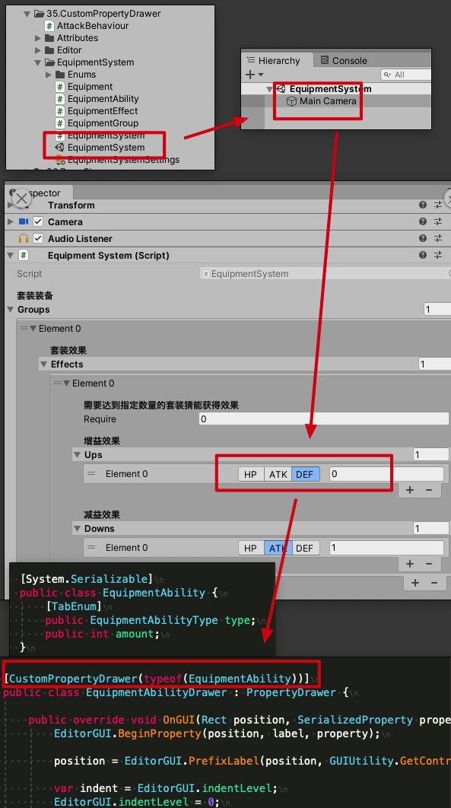

```
自定义属性界面
```


[DrawGizmo](Assets/Unity-Attributes-Example/36.DrawGizmo/Editor/MyScriptGizmoDrawer.cs)


```
自定义Scene窗口的Gizmo

public class MyScriptGizmoDrawer {

    [DrawGizmo(GizmoType.Selected | GizmoType.Active)]
    static void DrawGizmoForMyScript(MyScript scr, GizmoType gizmoType) {
        Vector3 position = scr.transform.position;

        if (Vector3.Distance(position, Camera.current.transform.position) > 10f)
            Gizmos.DrawIcon(position, "MyScript Gizmo.png", true);
    }
}
```


[InitializeOnLoad](Assets/Unity-Attributes-Example/37.InitializeOnLoad/Editor/InitializeOnLoadExample.cs)

```

// 打开项目后，生成该类，并调用该类的构造函数

/// <summary>
/// https://docs.unity3d.com/ScriptReference/InitializeOnLoadAttribute.html
///
/// Allows you to initialize an Editor class when Unity loads,
/// and when your scripts are recompiled.
/// Static constructors with this attribute are called
/// when scripts in the project are recompiled (also known as a Domain Reload).
/// when Unity first loads your project,
/// but also when Unity detects modifications to scripts
/// (depending on your Auto Refresh preferences),
/// and when you enter Play Mode (depending on your Play Mode configuration).
/// </summary>

// Running Editor Script Code on Launch

[InitializeOnLoad]
public class InitializeOnLoadExample {

    static InitializeOnLoadExample() {

        /// https://docs.unity3d.com/Manual/RunningEditorCodeOnLaunch.html

        //Debug.Log("Up and running");

        // editor frame update

        //EditorApplication.update += Update;

    }

    //static void Update() {
    //    Debug.Log("Updating");
    //}

}

```


[InitializeOnLoadMethod](Assets/Unity-Attributes-Example/37.InitializeOnLoad/Editor/InitializeOnLoadExample.cs)

```

// 打开Unity引擎后触发调用

[InitializeOnLoadMethod]
static void OnProjectLoadedInEditor() {
      /// https://docs.unity3d.com/ScriptReference/InitializeOnLoadMethodAttribute.html
      //Debug.Log("Project loaded in Unity Editor");
}

```


[OnOpenAsset](Assets/Unity-Attributes-Example/38.OnOpenAsset/Editor/OnOpenAssetExample.cs)

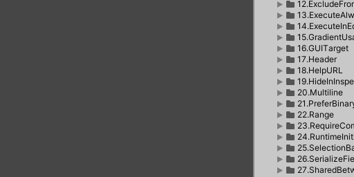

```
打开资源时（在Project窗口双击文件后）触发调用
```


[PostProcessBuild](Assets/Unity-Attributes-Example/39.PostProcessBuild/Editor/PostProcessBuildExample.cs) - 回调函数（每次发布程序后）

```
发布程序后触发调用

// PostProcessBuildExample.cs

[PostProcessBuild(1)]
public static void OnPostprocessBuild(BuildTarget target, string pathToBuiltProject) {
      // after build
      Debug.Log(target + ":" + pathToBuiltProject);
}

```


[PostProcessScene](Assets/Unity-Attributes-Example/40.PostProcessScene/Editor/PostProcessSceneExample.cs)

```

每次进入场景前触发调用

// PostProcessSceneExample.cs

[PostProcessScene(2)]
static void OnPostprocessScene() {
    OnBeforeSceneLoaded();
}

static void OnBeforeSceneLoaded() {
    var scene = UnityEngine.SceneManagement.SceneManager.GetActiveScene();
    Debug.LogWarning("OnBeforeSceneLoaded ======> " + scene.name + ".unity");
}

```


[GridPaintSorting](Assets/Unity-Attributes-Example/41.GridPaintSorting/README.md)（the sorting of Active Targets in the Active Tilemap list of the Tile Palette window）

- [官方文档](https://docs.unity3d.com/Packages/com.unity.2d.tilemap@1.0/api/UnityEditor.Tilemaps.GridPaintSortingAttribute.html)


[MenuItem](Assets/Unity-Attributes-Example/42.MenuItem/Editor/MenuTest.cs)

- [官方文档](https://docs.unity3d.com/ScriptReference/MenuItem.html)

[SettingsProvider](Assets/Unity-Attributes-Example/43.SettingsProvider/Editor/MyCustomSettings.cs)

- [官方文档](https://docs.unity3d.com/2019.1/Documentation/ScriptReference/SettingsProvider.html)
